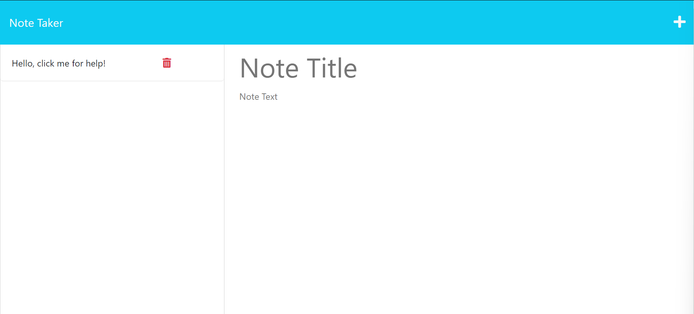

# note-taker

## Description

This Note Taker application and the code I've added to it is meant to be the missing puzzle piece between the back-end and front-end to work together.

I was able to establish effective routing pathways to not only display HTML pages but also being able to take in HTTP Methods such as GET, POST and Delete requests to work in tandem with front-end interactions.

I've demonstrated the following HTTP Requests with how they function:

- GET is able to pull any and all key value data from 'db.json' while actively reading the file for any changes and updates it in real time.
- POST recognizes the title and text fields populated and (once saved) will convert the string data into json and parse it into the body of 'db.json'
- DELETE looks for a specific note id and recognizes it before deletion, preventing all notes from being deleted

## Credits

Starter code provided by the University of Utah and improved by AegeanGrey/Todd D.

## License

MIT License

Copyright (c) 2023 Todd D.

Permission is hereby granted, free of charge, to any person obtaining a copy
of this software and associated documentation files (the "Software"), to deal
in the Software without restriction, including without limitation the rights
to use, copy, modify, merge, publish, distribute, sublicense, and/or sell
copies of the Software, and to permit persons to whom the Software is
furnished to do so, subject to the following conditions:

The above copyright notice and this permission notice shall be included in all
copies or substantial portions of the Software.

THE SOFTWARE IS PROVIDED "AS IS", WITHOUT WARRANTY OF ANY KIND, EXPRESS OR
IMPLIED, INCLUDING BUT NOT LIMITED TO THE WARRANTIES OF MERCHANTABILITY,
FITNESS FOR A PARTICULAR PURPOSE AND NONINFRINGEMENT. IN NO EVENT SHALL THE
AUTHORS OR COPYRIGHT HOLDERS BE LIABLE FOR ANY CLAIM, DAMAGES OR OTHER
LIABILITY, WHETHER IN AN ACTION OF CONTRACT, TORT OR OTHERWISE, ARISING FROM,
OUT OF OR IN CONNECTION WITH THE SOFTWARE OR THE USE OR OTHER DEALINGS IN THE
SOFTWARE.

## Features

Needing to keep track of all your tasks in one place? Note Taker has you covered!

Here's how to use the application:

1.) Open the Note Taker Webpage - https://noteynotes-a2993dbf9bbe.herokuapp.com 

2.) On the homepage click the blue button that says 'Get Started'

3.) On the left-hand side will be a demo note you can refer to and on the right-side is where you can input your notes title and description

4.) Once you have a title and desctription filled out, you will then see a save icon appear on the top right hand side of the page. Click that icon to save your note

5.) All saved notes will be on the left-hand side, to access any note click on the notes title and it will apear on the right-hand side of the webpage

6.) Once you are done with a note, you can delete it by clicking on the red trashbin icon to the right of the saved note

7.) Finally if you need create a new note click the plus icon on the top right corner of the page
